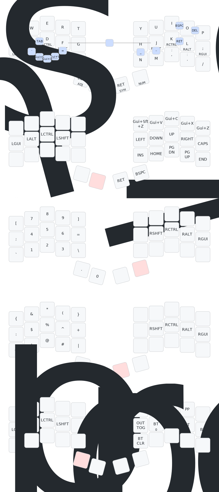

# My ZMK forager config

ZMK config for the [Forager](https://github.com/carrefinho/forager), a 34-key
wireless split keyboard running on Seeed XIAO BLE (nRF52840) controllers.
Left half is the central (connects to the computer); right half links to the left.

based on:
- https://github.com/Keycapsss/zmk-config/tree/main

## Keymap

QWERTY base with GACS home row mods, vim-style navigation, and a
urob-inspired setup (timeless positional home row mods, punctuation
mod-morphs, smart num layer).

The diagram above is generated automatically from
[`config/forager.keymap`](config/forager.keymap) by
[keymap-drawer](https://github.com/caksoylar/keymap-drawer) via the
[Draw keymap](.github/workflows/draw-keymap.yml) workflow whenever the
keymap changes.

## How typing works

### Layers

| Hold | Layer |
|---|---|
| SPACE (left thumb) | **NAV** — vim arrows on HJKL, clipboard on the top row, page nav below |
| RET (right thumb) | **SYM** — programming symbols on the left hand, parens on the thumbs |
| BSPC (right thumb) | **NUM** — numpad on the left hand, `0` on the thumb |
| SPACE + RET together | **ADJ** — bluetooth, volume, output, system keys |

### Home row mods

There are no dedicated modifier keys — the home row does double duty.
**Tap** `A S D F / J K L ;` for letters, **hold** for `⌘ ⌥ ⌃ ⇧` (mirrored on
both hands). The timing is tuned urob-style so mods never fire during normal
typing: holds register after 280 ms, only for cross-hand combinations
(`hold-trigger-key-positions`), and never mid-typing-flow
(`require-prior-idle-ms`). Just type; press-and-hold when you want a modifier.

### Punctuation morphs

| Key | Tap | With ⇧ | With ⌃⇧ |
|---|---|---|---|
| `,` | `,` | `;` | `<` |
| `.` | `.` | `:` | `>` |

### Word modes

- **Caps Word** — press `F`+`J` together, then type: everything is
  capitalized until space or punctuation. Great for `CONSTANTS`.
- **Num Word** — press `J`+`K` together: the NUM layer latches so you can
  type `3.14` or `2026-07-24` with both hands free, and releases
  automatically at the first non-number key.

### Combos

Press two neighboring keys at once:

| Combo | Result | | Combo | Result |
|---|---|---|---|---|
| `Q`+`W` | Esc | | `F`+`J` | Caps Word |
| `S`+`D` | Tab | | `J`+`K` | Num Word |
| `K`+`L` | Enter | | `J`+`M` | `-` |
| `I`+`O` | Backspace | | `H`+`N` | `_` |
| `O`+`P` | Delete | | `F`+`V` | `=` |
| `X`+`C` | ⌘C copy | | `S`+`X` | `` ` `` |
| `C`+`V` | ⌘V paste | | `X`+`V` | ⌘X cut |

## Connecting to multiple systems

The keyboard stores **four independent bluetooth profiles**; each remembers
its own paired computer. All bluetooth keys live on the ADJ layer
(**hold SPACE + RET together**):

| ADJ chord + | Action |
|---|---|
| `J` / `K` / `L` / `;` | Switch to profile 0 / 1 / 2 / 3 |
| `N` | Clear the **current** profile's pairing (`BT_CLR`) |
| `H` | Toggle output between USB and bluetooth (`OUT_TOG`) |

To pair a new computer: switch to an unused profile, then add
"**forager_sk**" from that computer's bluetooth settings. To move between
already-paired computers, just switch profiles — the keyboard drops the
current host and connects to the profile's host in a second or two.

If a pairing misbehaves, clear it on **both** sides: forget the keyboard in
the computer's bluetooth settings *and* press ADJ chord + `N` with that
profile active — a half-cleared pairing causes connect-but-no-typing states.

When charging over USB, USB output works regardless of profile (toggle with
ADJ chord + `H` if the wrong output is active).

## Power and sleep

The Forager has no power switch; power is managed in firmware:

- **Idle** after 10 minutes without typing — lights off, connection kept.
- **Deep sleep** after 15 minutes — bluetooth drops, near-zero battery
  drain. Tap any key on a sleeping half to wake it; the waking tap itself
  is swallowed, and reconnection takes a second or two.
- Charge over USB-C on either half.

## Flashing firmware

Firmware is built by GitHub Actions on every push — there is nothing to
install locally.

1. Open the latest green run under
   [Actions → Build ZMK firmware](../../actions), and download the
   `firmware` artifact zip. It contains three UF2 files: left half, right
   half, and `settings_reset`.
2. Put the half you're flashing into bootloader mode:
   - **Double-tap the reset button** on its XIAO BLE, or
   - from the keyboard: hold SPACE+RET and tap **Z** (`&bootloader`, ADJ
     layer) — this only reaches the left half's bootloader.
   The board mounts as a USB drive named `XIAO-SENSE`.
3. Drag the matching `.uf2` onto the drive. It flashes itself and reboots;
   the drive disappearing is normal.
4. Which halves need flashing:
   - Keymap-only changes → **left half** is enough.
   - `forager.conf` changes (sleep, bluetooth settings…) → **both halves**.

Pairing between the two halves and to your computers survives normal
reflashing. If pairing gets into a broken state, flash `settings_reset`
to **both** halves, then flash the normal firmware back — this wipes all
bonds, so you'll re-pair with everything. See the
[ZMK connection troubleshooting guide](https://zmk.dev/docs/troubleshooting/connection-issues).

## Changing the keymap

- **Permanent changes:** edit
  [`config/forager.keymap`](config/forager.keymap), push, flash. The keymap
  diagram above re-draws itself on every push.
- **Live experiments:** [ZMK Studio](https://zmk.studio) in Chrome lets you
  remap keys over USB with no reflash — connect the left half by cable and
  press ADJ chord + `Q` (`&studio_unlock`) to allow changes. Studio changes
  live on the keyboard only, so make keeper-changes in the repo.

## Troubleshooting

| Symptom | Fix |
|---|---|
| Mac woke from sleep, keyboard won't reconnect | Toggle bluetooth off/on in Control Center — macOS Tahoe 26.5.2 bug, not the keyboard; this config carries mitigations (`CONFIG_BT_GATT_ENFORCE_SUBSCRIPTION=n`, deep sleep) |
| Right half stops responding after long idle | Press the right half's reset button once — ZMK main regression, fix pending upstream ([zmk#3411](https://github.com/zmkfirmware/zmk/pull/3411)) |
| Connected but nothing types | Stale pairing — clear both sides and re-pair (see above) |
| Everything is weird | `settings_reset` flash to both halves (see Flashing) |
